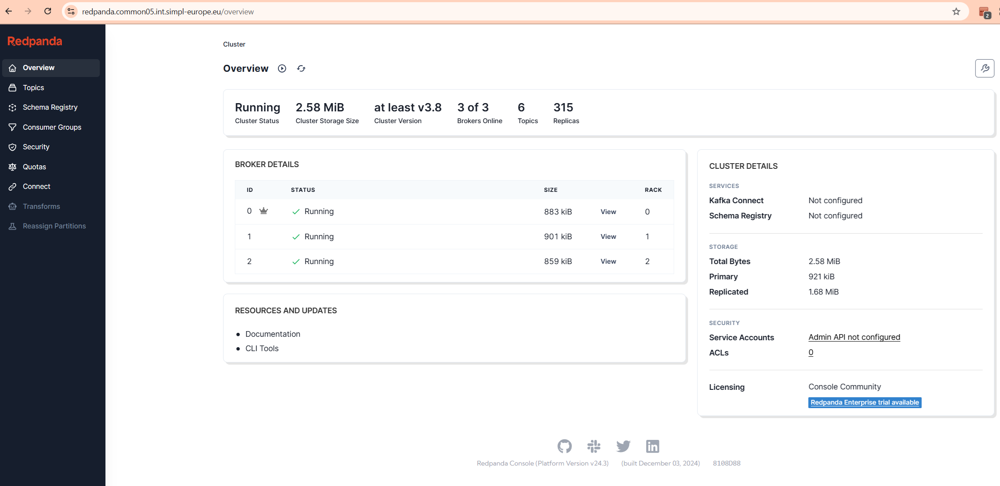
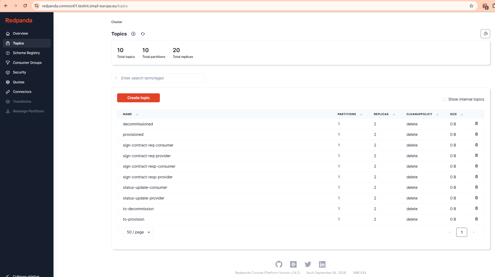
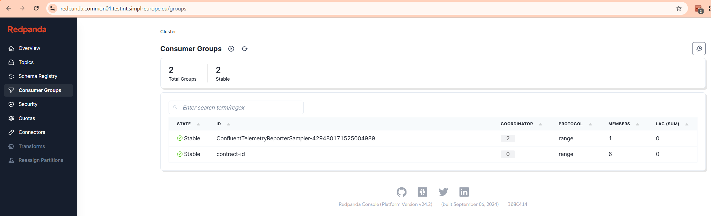
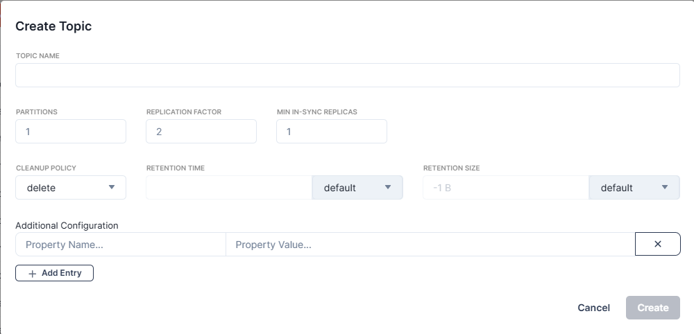

# Kafka administration

### Overview

Common Components repo includes three components that are used as Kafka stack. Those are:
* Confluent Operator, provided by a chart *confluent-for-kubernetes* from https://packages.confluent.io/helm
* Kafka stack, from repository https://code.europa.eu/simpl/simpl-open/development/common-components/kafka
* Redpanda Console, an open source UI, provided by a chart *console* from https://charts.redpanda.com

Redpanda console serves as an UI to administer the Kafka stack. 

### Kafka configuration

There are a couple options you can set in Kafka deployment. Below you can find a table explaining them:

| Variable name              | Default value | Description     |
| ----------------------     | :-----:       | --------------- |
| kafka.replicas             | 3             | Count of Kafka replicas |
| kafka.topic.replicas       | 2             | Number of requested topic replicas |
| kafka.topic.insyncreplicas | 1             | Number of topic replicas for topic to be shown as in sync |
| kraftController.replicas   | 3             | Count of Kraft Controller replicas |
| kafka.auth.enabled         | true          | Should kafka SASL PLAIN authentication be enabled |
| kafka.topic.autocreate     | false         | Should topics be automatically created if they don't exist |

If kafka.auth.enabled is set as true, you need to have the Secret created in Vault. Secret creation is described in "Secret for Kafka" section in the README.md file. 

### Redpanda Console

#### Console access

You can access the console by going to https url redpanda.*namespaceTag*.*domainSuffix*

For credentials you need to access the Vault, you'll find them in secret named *namespaceTag*-redpanda-credentials.

#### Console overview

After accessing the website above and entering the credentials set up with values, you will see the following screen.

Using the menu on the right, you'll be able to see topics,

Consumer groups, etc. 

#### Creating Topics

By clicking "Create topic" button you are able to add topics.

The topics to be created are listed below. All topics have 1 partition, 2 replicas (with exception of contract_consumption.transfer) and cleanup policy set to delete. Retention time and size leave on default.

* 1.contract_consumption.transfer -- 1 replica only!
* 2.decommissioned
* 3.iaa.authority.eu.europa.ec.simpl.authenticationprovider.events.credential.updated
* 4.iaa.consumer.eu.europa.ec.simpl.authenticationprovider.events.credential.updated
* 5.iaa.dataprovider.eu.europa.ec.simpl.authenticationprovider.events.credential.updated
* 6.iaa.dataprovider.eu.europa.ec.simpl.authenticationprovider.events.identity-attributes.updated
* 7.notifications
* 8.provisioned
* 9.sign-contract-req-consumer
* 10.sign-contract-req-provider
* 11.sign-contract-resp-consumer
* 12.sign-contract-resp-provider
* 13.status-update-consumer
* 14.status-update-provider