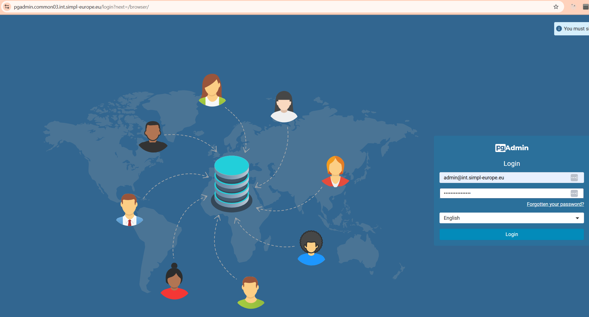
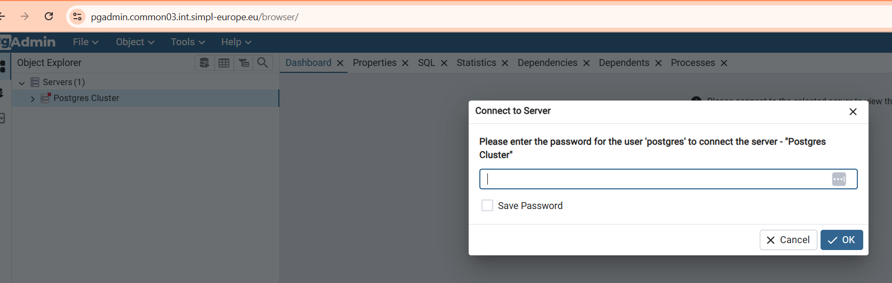
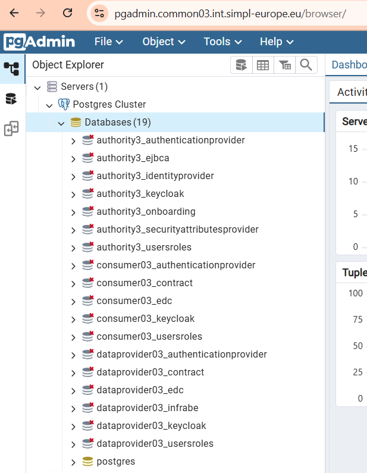
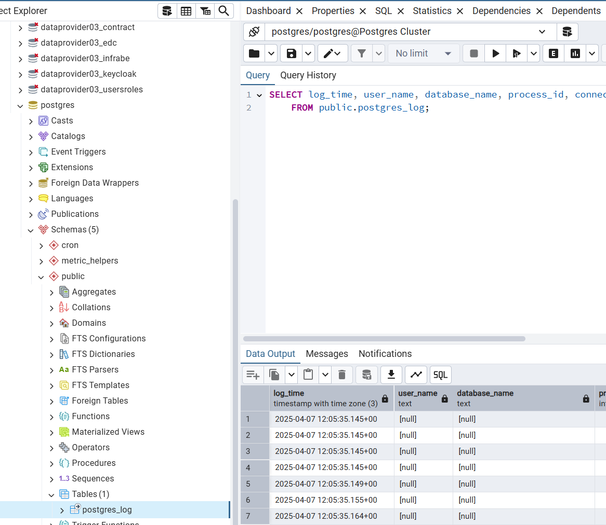

# PostgreSQL administration

### Overview

Common Components repo includes three components that are used as Kafka stack. Those are:
* Postgres Operator, provided by a chart *postgres-operator* from https://opensource.zalando.com/postgres-operator/charts/postgres-operator
* Postgres cluster, from repository https://code.europa.eu/simpl/simpl-open/development/common-components/postgres-cluster
* PGAdmin Console, an open source UI, provided by a chart *pgadmin4* from https://helm.runix.net

PGAdmin console serves as an UI to administer the Postgres stack. 

### Postgres configuration

Postgres cluster deployment basically creates all necessary databases based on agent list provided in values.
It looks for example like this:

```
agentList:
  authorities:
    - authority1
  consumers:
    - consumer01
  providers:
    - dataprovider01
```

All the credentials for the created databases are stored in Kubernetes secrets, named for example "authority3-identityprovider.pg-cluster.credentials.postgresql.acid.zalan.do", where first is the database name, then cluster name, and the rest is preconfigured. 

### PGAdmin Console

#### Console access

You can access the console by going to https url pgadmin.*namespaceTag*.*domainSuffix*



Login is admin@*domainSuffix*. Password is provided in Vault, you'll find it in secret named *namespaceTag*-pgadmin-credentials, in key named "password". 

#### Console overview

After accessing the website above, if you extend the Servers list, you will see the following request for password.
Password is in the same vault secret, in key named "postgres".



Using the menu on the left, you can see the list of the created databases.



To access the tables from a database, you need to expand Schemas, then Public, then Tables. You can right click and perform a SELECT on a table to view its content.

