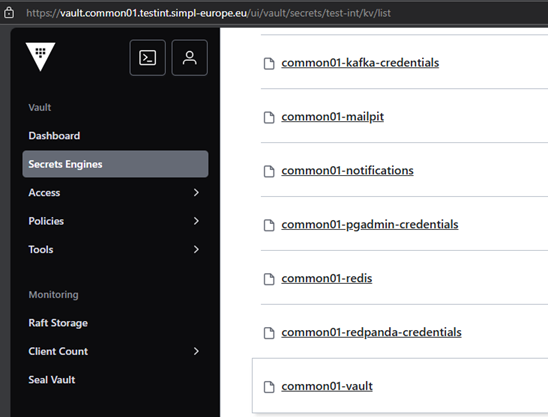
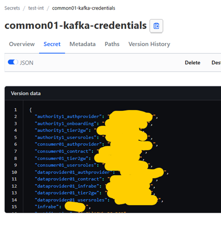
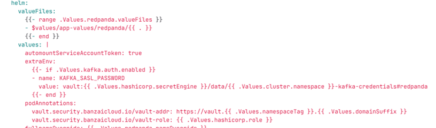
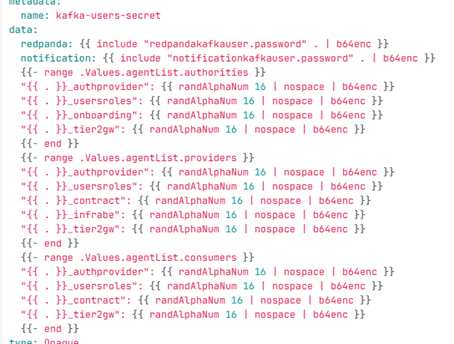
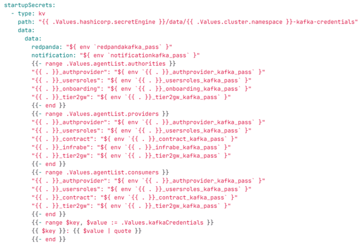
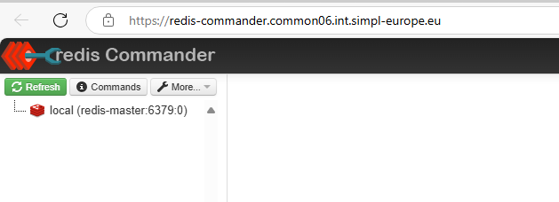
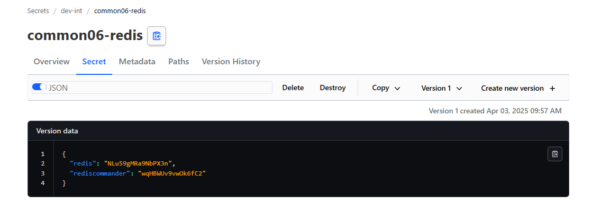

# Common Components Agent

<!-- TOC -->
* [Common Components Agent](#common-components-agent)
  * [Description](#description)
  * [Pre-Requisites](#pre-requisites)
    * [Tools](#tools)
  * [Installation](#installation)
    * [Prerequisites](#prerequisites)
      * [Create the Namespace](#create-the-namespace)
    * [Deployment using ArgoCD](#deployment-using-argocd)
    * [Manual deployment](#manual-deployment)
      * [Files preparation](#files-preparation)
      * [Deployment](#deployment)
    * [Monitoring](#monitoring)
* [Troubleshooting](#troubleshooting)
<!-- TOC -->

## Description
This project contains the configuration files required for deploying an application using Helm and ArgoCD. 
- the deployment will be done by master helm chart allowing to deploy **Common components** using a single command.
- templates of values.yaml files used inside *Integration* environment under `app-values` folder

## Pre-Requisites

Ensure you have the following tools installed before starting the deployment process:
- Git
- Helm
- Kubectl

Additionally, ensure you have access to a Kubernetes cluster where ArgoCD is installed.

The following versions of the elements will be used in the process:

| Pre-Requisites         |     Version     | Description                                                                                                                                     |
| ---------------------- |     :-----:     | ----------------------------------------------------------------------------------------------------------------------------------------------- |
| DNS sub-domain name    |       N/A       | This domain will be used to address all services of the agent. <br/> example: `*.authority1.int.simpl-europe.eu`                            |  
| Kubernetes Cluster     | 1.29.x or newer | Other version *might* work but tests were performed using 1.29.x version                                                                        |
| nginx-ingress          | 1.10.x or newer | Used as ingress controller. <br/> Other version *might* work but tests were performed using 1.10.x version. <br/> Image used: `registry.k8s.io/ingress-nginx/controller:v1.10.0`  |
| cert-manager           | 1.15.x or newer | Used for automatic cert management. <br/> Other version *might* work but tests were performed using 1.15.x version. <br/> Image used: `quay.io/jetstack/cert-manager-controller::v1.15.3` |
| argocd                 | 2.11.x or newer | Used as GitOps tool . App of apps concept. <br/> Other version *might* work but tests were performed using 2.11.x version. <br/> Image used: `quay.io/argoproj/argocd:v2.11.3` |
| kube-state-metrics  | 2.13.x or newer | Used for monitoring, Metricbeat statuses in Kibana dashboard    |

## Installation

### Prerequisites

#### Create the Namespace

As an update from previous version, all the agent namespaces now are created automatically. 

### Deployment using ArgoCD

You can easily deploy the agent using ArgoCD. All the values mentioned in the sections below you can input in ArgoCD deployment. The repoURL gets the package directly from code.europa.eu.
targetRevision is the package version. 

```
apiVersion: argoproj.io/v1alpha1
kind: Application
metadata:
  name: 'common-deployer'                           # name of the deploying app in argocd
spec:
  project: default
  source:
    repoURL: 'https://code.europa.eu/api/v4/projects/951/packages/helm/stable'
    path: '""'
    targetRevision: 2.0.0                           # version of package
    helm:
      values: |
        values:
          branch: v2.0.0                            # branch of repo with values 
    targetRevision: 1.3.2                           # version of package
    helm:
      values: |
        values:
          branch: v1.3.2                            # branch of repo with values 
>>>>>>> origin/develop
        agentList:                                  # list of all the agents to be deployed
          authorities:
            - authority1
          consumers:
            - consumer01
          providers:
            - dataprovider01
        project: default                            # Project to which the namespace is attached
        namespaceTag: common                        # identifier of deployment and part of fqdn
        domainSuffix: int.simpl-europe.eu           # last part of fqdn
        argocd:
          appname: common                           # name of generated argocd app 
          namespace: argocd                         # namespace of your argocd
        cluster:
          address: https://kubernetes.default.svc
          namespace: common                         # where the app will be deployed
          issuer: dev-prod                          # issuer of certificate
          kubeStateHost: kube-prometheus-stack-kube-state-metrics.devsecopstools.svc.cluster.local:8080    # link to kube-state-metrics svc
        hashicorp:
          secretEngine: dev-int                     # name of the kv secret engine that will be created in vault
          role: dev-int-role                        # name of the role that will be created in vault
        kafka:
          topic:
            autocreate: true                        # set to true if kafka should automatically create topics
        mailpit:
          enabled: true                             # set to true if mailpit should be deployed as mock smtp for notification service
        monitoring:
          enabled: true                             # should monitoring be enabled
    chart: common_components                        # chart name
  destination:
    server: 'https://kubernetes.default.svc'
    namespace: common                               # where the package will be deployed
```

### Manual deployment

##### Files preparation

Another way for deployment, is to unpack the released package to a folder on a host where you have kubectl and helm available and configured. 

There is basically one file that you need to modify - values.yaml. 
There are a couple of variables you need to replace - described below. The rest you don't need to change.

```
values:
  branch: v2.0.0                            # branch of repo with values 

agentList:                                  # list of all the agents to be deployed
  authorities:
    - authority1
  consumers:
    - consumer01
  providers:
    - dataprovider01

project: default                            # Project to which the namespace is attached

namespaceTag: common                        # identifier of deployment and part of fqdn
domainSuffix: int.simpl-europe.eu           # last part of fqdn

argocd:
  appname: common                           # name of generated argocd app 
  namespace: argocd                         # namespace of your argocd

cluster:
  address: https://kubernetes.default.svc
  namespace: common                         # where the app will be deployed
  issuer: dev-prod                          # issuer of certificate
  kubeStateHost: kube-prometheus-stack-kube-state-metrics.devsecopstools.svc.cluster.local:8080    # link to kube-state-metrics svc

hashicorp:
  secretEngine: dev-int                     # name of the kv secret engine you'll create in vault
  role: dev-int-role                        # name of the role you'll create in vault

kafka:
  topic:
    autocreate: true                        # set to true if kafka should automatically create topics

mailpit:
  enabled: true                             # set to true if mailpit should be deployed as mock smtp for notification service

monitoring:
  enabled: true                             # should monitoring be enabled
```

##### Deployment

After you have prepared the values file, you can start the deployment. 
Use the command prompt. Proceed to the folder where you have the Chart.yaml file and execute the following command. The dot at the end is crucial - it points to current folder to look for the chart. 

Now you can deploy the agent:

`helm install common . `

### Monitoring

ELK stack for monitoring is added with this release.  
Its deployment can be disabled by switch the value monitoring.enabled to false.  
When it's enabled, after the stack is deployed, you can access the ELK stack UI by https://kibana.**namespacetag**.**domainsuffix**  
Default user is "elastic", its password can be extracted by kubectl command. `kubectl get secret elastic-elasticsearch-es-elastic-user -o go-template='{{.data.elastic | base64decode}}' -n {namespace}`

### Vault Configuration

In our project, we use Vault to increase security in different namespaces. Vault is a powerful tool for managing secrets, such as passwords, tokens, and encryption keys.
Additionally, our environment has been enriched with the vault-secrets-webhook module, which facilitates integration between Vault and our application.

Applications retrieve all necessary passwords, keys, and tokens from Vault based on the appropriate definitions contained in the application.yaml file.


**_IMPORTANT_**: **dataprovider_namespace**-gitea secret is not in use as Gitea credential yet.

Example entries in Vaults look like this:



**_As an update from previous version, most of the Vault configuration is now applied automatically.
You just need to create a key for Signer and update a couple of values, which is mentioned in other agents readmes._**

**_All the credentials (for Keycloak and other components) are also now automatically stored in Vault - review the secrets for credentials if needed._**

You can access vault on https://vault.**namespacetag**.**domainsuffix**
Root token can be found in secret vault-unseal-keys, in key vault-root. 

The application retrieves them according to the following configuration:





However, supplying the vault with the appropriate set of values ​​is done when building Vault containers.

This is defined in two files located in the https://code.europa.eu/simpl/simpl-open/development/common-components/vault.git repository:
vault/charts/templates/secrets.yaml and vault/charts/templates/vault.yaml.

1. vault/charts/templates/secrets.yaml
The secrets.yaml file is used to create Kubernetes secrets that Vault gets the credentials from.
This file defines how secrets will be created in the Kubernetes environment to be later used by Vault.
A sample definition for one of our tools is:



2. vault/charts/templates/vault.yaml
The vault.yaml file configures Vault in the Kubernetes environment, ensuring that it has the necessary resources and policies to securely manage secrets.
Furthermore, when our application needs a secret, it retrieves it from Vault using the configuration and policies defined in the vault.yaml file.



The above configuration ensures that passwords and other secrets are generated securely and managed efficiently, reducing the risk of security breaches and simplifying the management of secrets across namespaces.


### Redis-commander

Redis commander is a frontend that allows to view data stored in redis-master



it can be accessed via an ingress. Password for redis commander is stored in a vault secret in common-redis secret.
Default username is : admin

Example of secret stored in a common namespace (common06 in this example)


